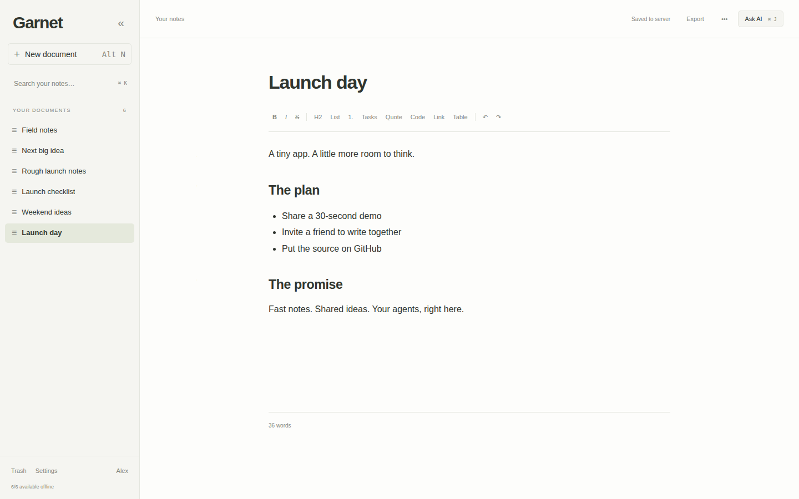
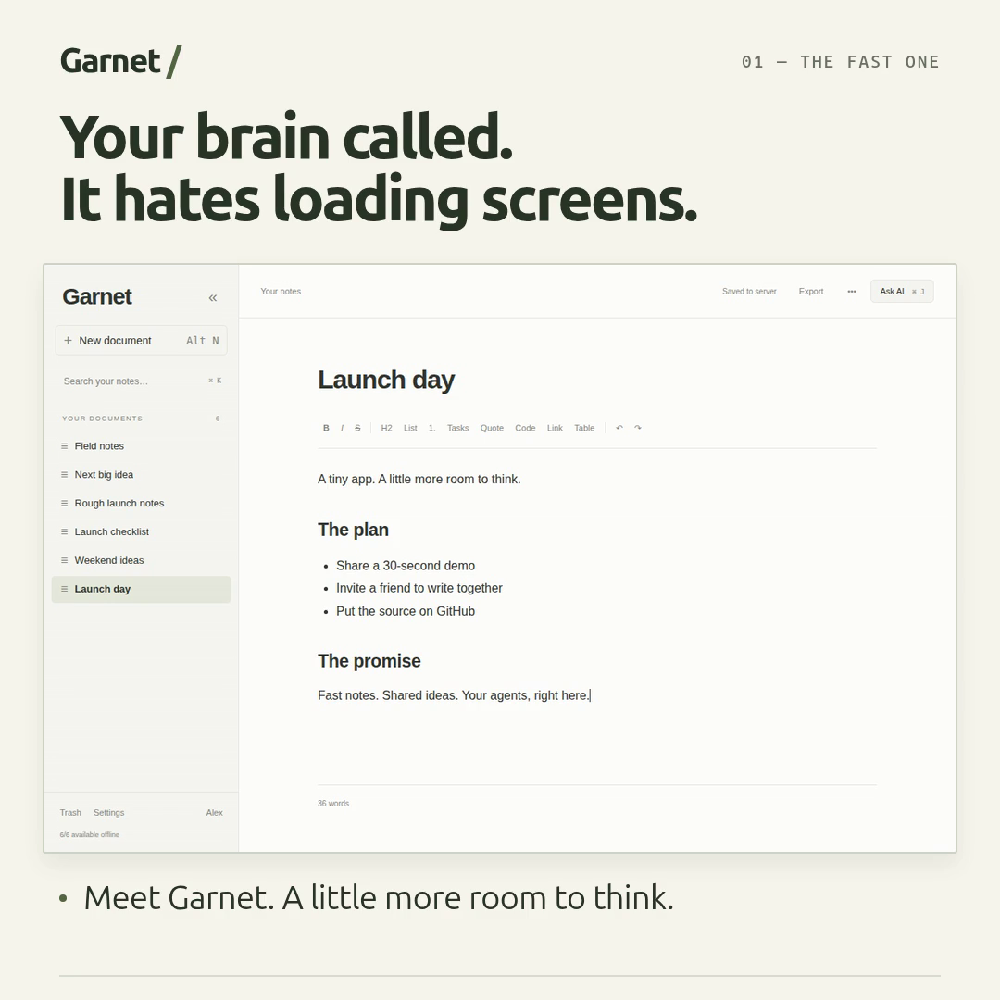
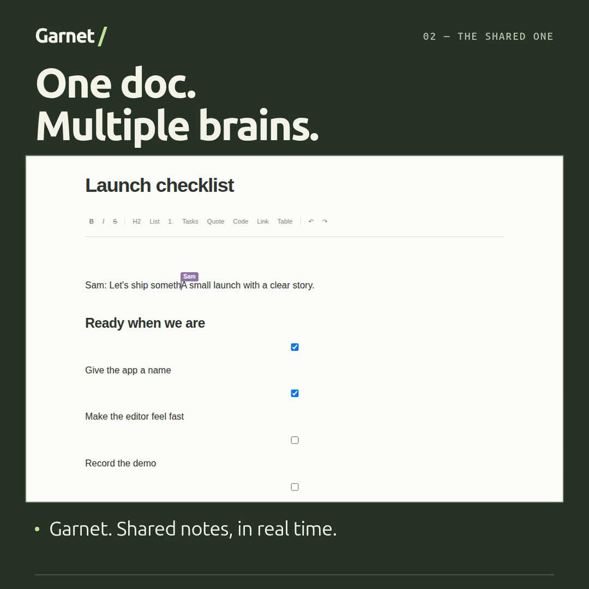
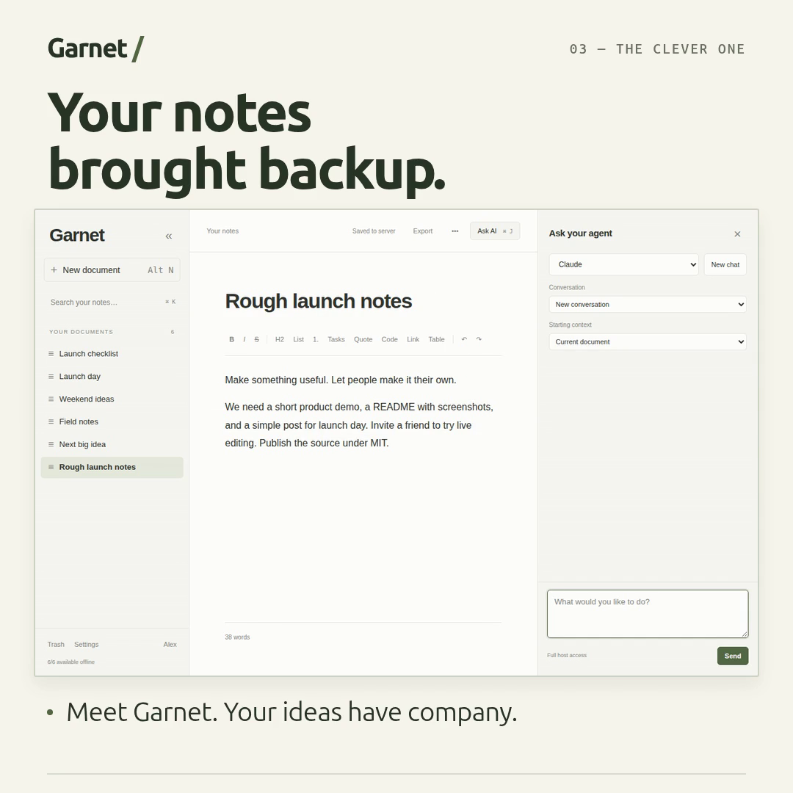
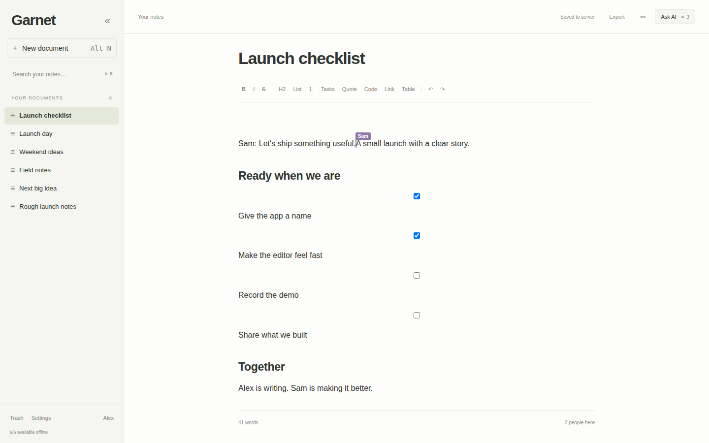
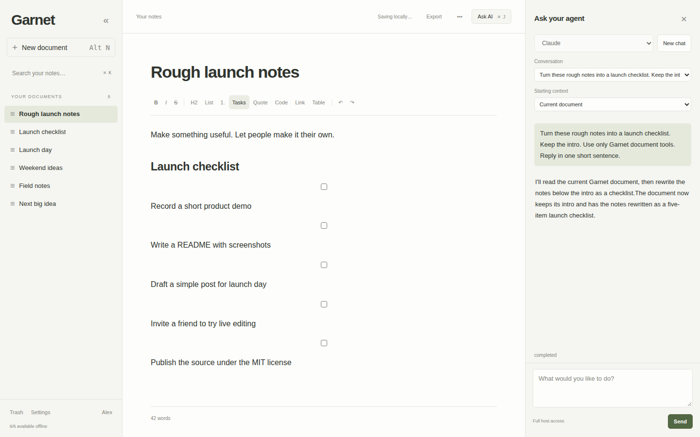
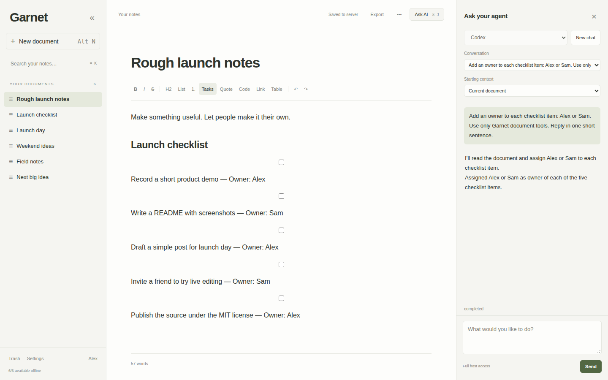

# Garnet

Shared notes with local autosave, live collaboration, and optional Claude/Codex agents. Free, open source, [MIT licensed](LICENSE).

## Install

```sh
curl -fsSL https://raw.githubusercontent.com/keysforthewin/Garnet/main/install.sh | bash
```

Press **Enter** to accept port **7777**, or type your preferred port.

Open the **local URL printed by the installer** (normally `http://127.0.0.1:7777`). Sign in with **admin / password**, then choose a new password. Busy ports are handled automatically.

The installer handles dependencies, starts the app in the background, enables startup after reboot—even before login—and checks daily for stable app releases. It uses your running MongoDB server when available; otherwise it sets up a database container. If setup stops because a prerequisite is missing, install it and rerun the same command. Completed database setup and existing notes are reused.



## Garnet in 30 seconds

Three square, silent demos with text overlays. Use the previews to open the videos.

| Your brain hates loading screens | One doc. Multiple brains. | Your notes brought backup |
| --- | --- | --- |
| [](docs/media/garnet/01-speed.mp4?raw=true) | [](docs/media/garnet/02-together.mp4?raw=true) | [](docs/media/garnet/03-agents.mp4?raw=true) |
| [Watch / download MP4](docs/media/garnet/01-speed.mp4?raw=true) | [Watch / download MP4](docs/media/garnet/02-together.mp4?raw=true) | [Watch / download MP4](docs/media/garnet/03-agents.mp4?raw=true) |

- **Keep the editor moving.** A Web Worker handles library search and saves the local copy of each document, off the UI thread. Editing and cached navigation happen locally.
- **Save as you write.** Local autosave keeps your changes on the device; sync to the server happens in the background.
- **Write together.** Live cursors and incremental Yjs updates keep collaboration responsive. Background library caching supports offline work.
- **Bring your agents.** Claude and Codex can read and edit documents through Garnet's tools, using your existing host CLI accounts. Agent service usage is separate from the free app.
- **Pick up offline.** A service worker caches the app shell, and IndexedDB stores your documents. Reconnect to merge changes.

<details>
<summary>See collaboration and agents in action</summary>

**Live collaboration:** Alex and Sam editing the same launch checklist.



**Claude:** rough notes become a launch checklist in the active document.



**Codex:** the checklist gets an owner for each next step.



These captures use fictional demo notes and real agent runs. Agent waiting is shortened and labeled in the videos. [Capture and rendering instructions](scripts/media/README.md).

</details>

## Cloudflare Tunnel: public HTTPS

Garnet serves **HTTP only** on loopback. Cloudflare supplies the public HTTPS certificate and encrypted tunnel. Run `cloudflared` directly on the **same machine** as Garnet; the only optional application container is MongoDB.

### 1. Find your local app address

Install Garnet, change the initial password, then run:

```sh
garnet url
```

Copy the printed address, for example `http://127.0.0.1:7778`. Use the actual port it prints throughout the tunnel setup. Check that the app is healthy:

```sh
curl "$(garnet url)/api/health"
```

The response should be `{"ok":true}`.

### 2. Create a tunnel, or select your existing one

You need a Cloudflare account and a domain managed by Cloudflare.

In the [Cloudflare dashboard](https://dash.cloudflare.com/), open **Networking → Tunnels**. For a new tunnel, choose **Create Tunnel**, name it, then select your Linux distribution and CPU architecture under **Setup Environment**. Run the dashboard's **Install and Run** commands on the Garnet machine. These install the native `cloudflared` connector and its background service. The service command has this form:

```sh
sudo cloudflared service install <TUNNEL_TOKEN>
```

Use the private token from your dashboard. Wait for the tunnel to show **Healthy**. If a dashboard-managed tunnel is already running on this machine, select it and continue below; skip installing another connector. These steps follow [Cloudflare's current setup guide](https://developers.cloudflare.com/tunnel/get-started/).

### 3. Connect a public hostname to Garnet

In your tunnel, open **Routes → Add route → Published application**:

| Field | Value |
| --- | --- |
| Hostname | Your subdomain and domain, for example `notes.example.com` |
| Service URL | The exact **HTTP** address from `garnet url`, for example `http://127.0.0.1:7778` |

If your dashboard separates the service fields, choose **HTTP** as the type and enter `127.0.0.1:7778` as the address. Save the route. Open **https://notes.example.com** in your browser.

The browser uses HTTPS to Cloudflare, and the connector forwards to Garnet over local HTTP. No router port forwarding is needed. Publish only the app's HTTP address; MongoDB stays private.

## Prerequisites

- Linux
- MongoDB
- Node 22.12+ or 24

## Uninstall

```sh
garnet uninstall
```

Confirm the prompt to delete the app, downloaded releases and private Node runtime, background services and update timer, command, and managed MongoDB container and **all its notes and database storage**. Export anything you want to keep first. For unattended removal, use `garnet uninstall --yes`.

An existing host MongoDB server and its databases are preserved, as are data adopted from a source checkout. Shared system packages (including Docker/Podman and system Node), shell PATH settings, and external Cloudflare tunnels remain yours. An image downloaded by this installer is removed if no other container needs it.

## Agents

Garnet runs the web server and agent executor in **one Node process**, managed by the `garnet.service` user service. Claude and Codex run as short-lived subprocesses for model discovery and agent jobs, using your existing host CLI logins. There is no separate runner to start. Settings → Agents controls executable paths, separate Claude/Codex model choices, working directory, and timeout. Model lists come from the installed CLIs at startup and refresh when an executable or working directory changes. Each selector also supports the CLI default and a custom model. Discovery only initializes the CLI and requests its catalog; it sends no prompt. Codex uses its [model/list interface](https://learn.chatgpt.com/docs/app-server#list-models-modellist); Claude returns models during its CLI initialization handshake. In the Ask your agent panel, the Model selector overrides the configured default for your next message and remembers that choice when you return to the conversation. Select New conversation to start a fresh chat. Starting context lists the current document once, followed by the library and other documents. Each signed-in user can invoke agents with the host account's full access.

## Offline use

Use the local loopback URL or your HTTPS Cloudflare hostname for browser offline support. Changing the hostname or local port creates a different browser origin, with its own login and offline cache.

The whole text library downloads in the background. After the application has loaded and caching finishes, you can reopen it offline, edit existing documents, and create new ones. Browser storage quotas and eviction policies still apply; use “Keep offline storage” and periodic exports. Agent jobs and shared settings require a server connection. Offline AI prompts remain drafts.

## Editing

- One click opens a document at your saved selection and scroll position.
- `Ctrl/Cmd+K` focuses library search; `Alt+N` creates a note; `Ctrl/Cmd+J` opens AI; `Ctrl/Cmd+\` opens or closes navigation.
- Formatting supports headings, emphasis, links, lists, checkboxes, quotes, code blocks, and simple tables. Markdown is the import/export format; whitespace and formatting syntax are normalized.
- Changes display immediately and save locally before syncing in the background. Document actions, including Export, are in the top-left menu.
- Changed content saves after 750 ms idle, at least every 5 seconds during continuous typing. Unchanged content does not create a version, change the saved timestamp, or rewrite its Markdown mirror. Collaboration state remains durable.
- Version previews compare each saved version with its predecessor: green additions, red removals, and yellow changed passages. Old duplicate snapshots are omitted from the list without deleting history.
- Pin documents from the pin icon beside each sidebar row. The menu combines document search and the document list with New document (Alt+N), Export, Version history, and Settings. Move to trash is in its own bottom section. Trash restores are shared actions.
- Export downloads current local content, including pending edits. Library ZIP export runs locally.

Mongo holds binary Yjs state, metadata, revisions, accounts, sessions, settings, preferences, and agent conversations. Plain Markdown is an asynchronous projection; it is not sufficient to recreate collaboration history or accounts.

## Files and data

Packaged installations live in `~/.local/share/garnet/`:

| Path | Purpose |
| --- | --- |
| `current` / `releases/` | Active and retained application releases |
| `install.json` | Private connection settings, runtime paths, and update preference |
| `data/documents/` | Markdown mirrors |
| `data/runtime/` | Document-tool socket and actual HTTP address in `listen.json` |
| Container volume `garnet-mongo` | Database for managed container installations |

A reused host MongoDB keeps its own storage. Adopted source installations keep their original `data/` paths. Source builds live in `build/`, with native MongoDB data in `data/mongo-host/`.

Builds and runtime use the host Node installation and npm dependencies. `./garnet build` installs dependencies, checks TypeScript, runs unit tests, and builds the app. The agent executor is included in `build/server.mjs`; `build/tools.mjs` is the short-lived MCP adapter launched by agent CLIs.

Direct edits to mirror files are **not imported**. Agents use the Garnet library's MCP tools for document changes. Those tools read live content and require a matching content version before edits, preserving concurrent human work. Requests may target the current document, another document, or the library. Full-host agent actions outside the library remain ordinary host actions.

## Updates and operations

The installer creates `~/.local/bin` and adds it to your shell’s startup configuration beside existing PATH settings when needed (Bash, Zsh, or Fish). Open a new terminal to pick up a PATH change, or run the command printed by the installer in your current terminal. Then use:

```sh
garnet url
garnet status
garnet logs
garnet stop
garnet start
garnet update
garnet autoupdate status
garnet autoupdate off
garnet autoupdate on
```

Automatic updates check daily, with up to an hour of randomized delay, and catch up after the machine has been off. Only published stable releases are installed. Downloads and dependencies are prepared before restarting the app. A failed health check restores the previous app release; this is an app rollback, not a database rollback. Update logs are available with `journalctl --user -u garnet-update.service`.

The database image is pinned when installed. Database, private Node runtime, container runtime, and operating-system upgrades remain separate maintenance tasks. Host Node installations follow their existing maintenance process.

`stop` leaves the database available for backups; stop `garnet-mongo.service` explicitly when needed for a managed database. Agent jobs are cancelled and their final events persisted during graceful shutdown. Interrupted jobs are never automatically rerun. Automatic updates can briefly interrupt editing connections and running agent jobs.

A service-worker update activates once older app tabs close. Close and reopen existing tabs to load the latest UI. Keep all tabs on the same version when modifying the editor schema.
